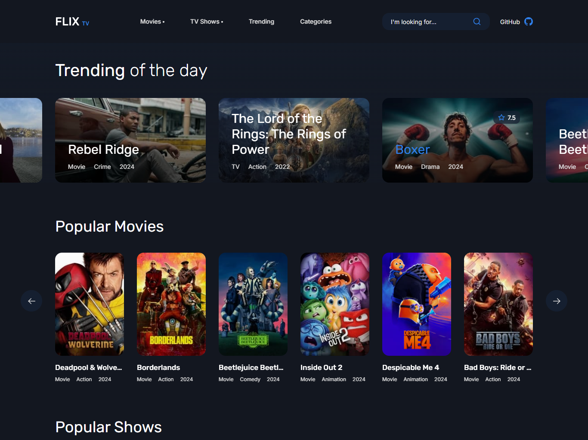

## FlixTV-Clone---Netflix-Style-Streaming-App-in-PHP-OOP

### Description

FlixTV Clone is a simple Netflix-style streaming platform built with PHP and Object-Oriented Programming (OOP). This project uses the TMDB API to fetch movie and TV show data and embeds videos from third-party websites. It focuses on client-side interaction and API integration, without implementing authentication or a backend system.



##### Watch Demo: [FlixTV Clone](https://flixtv.droqsic.com/)

### Prerequisites

To set up and run the FlixTV Clone project, you'll need the following tools and dependencies:

- **PHP**: Ensure you have PHP installed (version 7.4 or higher is recommended).
- **Composer**: A dependency manager for PHP. You can install Composer from [getcomposer.org](https://getcomposer.org/).
- **Git**: To clone the repository and manage version control. Download Git from [git-scm.com](https://git-scm.com/).

### Installation

1. **Clone the Repository**:

   ```bash
   git clone https://github.com/smokersaim/FlixTV.git

   ```

2. **Navigate to the Project Directory**:

   ```bash
   cd FlixTV

   ```

3. **Install Dependencies**:

   ```bash
   composer install

   ```

4. **Configure Your Environment**:
   Create a .env file

   ```bash
   BASE_URL='http://localhost'
   AUTHOR_URL='https://usamaraajput.com'
   GITHUB_URL='https://github.com'
   FACEBOOK_URL='https://facebook.com'
   INSTAGRAM_URL='https://instagram.com'
   TIKTOK_URL='https://tiktok.com'
   YOUTUBE_URL='https://youtube.com'

   AUTHOR_NAME='Usama Raajput'
   AUTHOR_EMAIL='AUTHOR_EMAIL'
   AUTHOR_NUMBER='AUTHOR_NUMBER'

   SMTP_HOST='SMTP_HOST'
   SMTP_USER='SMTP_USER'
   SMTP_PASSWORD='SMTP_PASSWORD'
   SMTP_PORT='587'
   SMTP_ENCRYPTION='TLS'

   APP_NAME='FlixTV'
   APP_TITLE='FlixTV - Watch Movies & TV Shows Online Free'
   APP_DESCRIPTION='Stream thousands of movies and TV shows for free on FlixTV. Discover new favorites and watch classic films anytime, anywhere.'
   APP_KEYWORDS='watch movies online free, free movies online, free tv shows online, stream movies online, free movie streaming, watch tv shows online free, online movies, online tv shows, free streaming, free movie streaming service, watch movies online without registration, best free movie streaming sites, top free movie sites, free movie streaming apps, free movie download, free tv series online, free movie streaming websites, free online movies no signup, free movies to watch online without downloading, free online movies with English subtitles, free movies to watch online without registration, best free movie streaming sites 2024, free movies to watch online legal, free online movies HD, free online movies for kids, free movies to watch online without interruptions, free movies to watch online on mobile, free movies to watch online full length'

   TMDB_API="TMDB_API"
   EMBED_URL="MEDIA_EMBED_SERVER_URL"

   ```

5. **Run the Application**:
   ```bash
   php -S localhost:8000
   ```

### Disclaimer!

This project is still under development. I am not a professional programmer and am still learning. I created this project with the help of ChatGPT, BlackBox AI, and Google Gemini. There may still be a lot of room for improvement. Your feedback means a lot to me, and I appreciate any suggestions or contributions to help make this project better. If you find this project useful or interesting, please consider giving it a star on GitHub!
